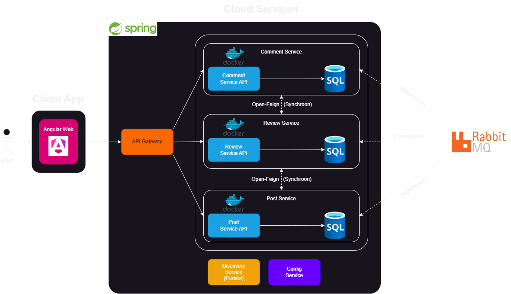

# Architecture

## Front-end via Browser

Zowel de gebruiker als de redacteur hebben toegang tot de Angular Web App via de browser.

## API Gateway

Gateway zorgt voor de communicatie tussen de front-end en de backend-services. Het zorgt voor alle requests die gestuurd worden tussen de front-end en de backend-services.

## 1. PostService: Laat redacteurs toe om posts aan te maken en aan te passen. Een post bestaat uit een titel, content, auteur, datum aangemaakt

- US1: Als redacteur wil ik nieuwe posts kunnen aanmaken, zodat ik nieuws en updates kan delen met de organisatie. Posts worden opgeslagen in een MySQL-database en communiceren met de ReviewService (synchroon). De ReviewService gebruikt een synchrone verbinding met de PostService om de status van een post op te vragen of bij te werken. Verstuurt meldingen over nieuwe posts naar de Message Service, zodat andere services zoals ReviewService en CommentService op de hoogte blijven (bv nieuwe reacties, goedkeuringen, afwijzingen) (asynchroon).
- US2: Als redacteur wil ik posts kunnen opslaan als concept, zodat ik er later aan kan verderwerken of kan wachten op goedkeuring
- US3: Als redacteur wil ik de inhoud van een post kunnen bewerken, zodat ik fouten kan corrigeren en inhoud kan bijwerken.
- US4: Als gebruiker wil ik een overzicht van gepubliceerde posts kunnen zien, zodat ik op de hoogte blijf van het laatste nieuws.
- US5: Als gebruiker wil ik posts kunnen filteren op basis van inhoud, auteur, datum

## 2. ReviewService: Laat redacteurs toe om posts goed te keuren of af te wijzen

- US7: Als redacteur wil ik ingediende posts kunnen bekijken en goedkeuren of afwijzen, zodat alleen goedgekeurde content wordt gepubliceerd.
- US8: Als redacteur wil ik een melding ontvangen wanneer een post goedgekeurd of afgewezen is, zodat ik weet of het gepubliceerd kan worden of moet worden herzien. De ReviewService een melding naar de Message Service om de redacteur op de hoogte te stellen (asynchroon).
- US9: Als redacteur wil ik opmerkingen kunnen toevoegen bij afwijzing van een post, zodat de redacteur weet welke wijzigingen er nodig zijn. Gebruikt PostService om status van een post op te halen (synchroon). Opmerkingen worden doorgestuurd naar de Message Service en door de PostService opgehaald (asynchroon).

## 3. CommentService: Laat gebruikers toe om reacties te plaatsen op posts

- US10: Als gebruiker wil ik een reactie kunnen plaatsen op een post, zodat ik mijn mening kan delen of vragen kan stellen. Het communiceert met de PostService voor postinformatie en gebruikt een eigen MySQL-database om reacties op te slaan (synchroon). Verstuurt meldingen via de Message Service, bijvoorbeeld bij nieuwe reacties. De PostService ontvangt deze meldingen (asynchroon).
- US11: Als gebruiker wil ik reacties van andere collega’s kunnen lezen, zodat ik een indruk krijg van hun mening of vragen over het artikel.
- US12: Als gebruiker wil ik mijn eigen reacties kunnen bewerken of verwijderen, zodat ik altijd mijn eigen bijdragen kan corrigeren of verwijderen.

## Message Service: RabbitMQ (message broker)

Zorgt voor asynchrone messaging traffic via RabbitMQ voor notificaties en updates. Dit is om services losjes gekoppeld te houden en schaalbaarheid te verbeteren.
RabbitMQ functioneert als een message broker. (asynchroon)

## Eureka

Dient als een service registry waar alle microservices zich registreren bij Eureka, zodat ze dynamisch door andere services kunnen worden gevonden (service discovery).

## Config Server

Beheert configuraties van alle microservices op 1 plek, wat nuttig is voor het efficiënt beheren van configuratiewijzigingen.
