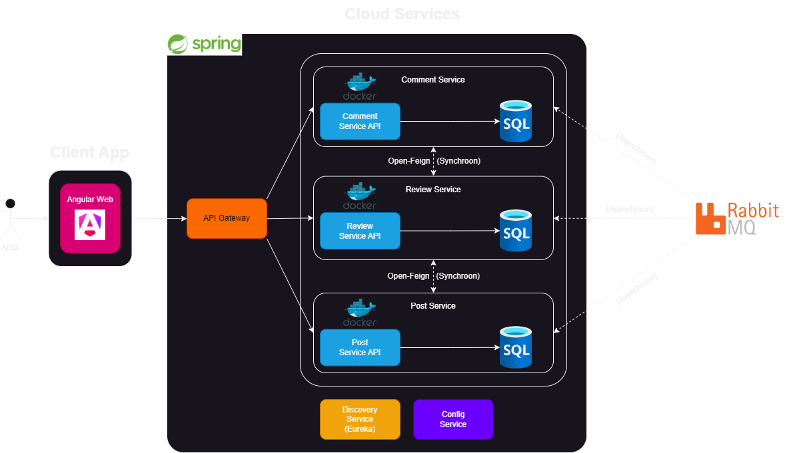

# Architecture

## Front-end via Browser

Zowel de gebruiker als de redacteur hebben toegang tot de Angular Web App via de browser.

## API Gateway

Gateway zorgt voor de communicatie tussen de front-end en de backend-services. Het zorgt voor alle requests die gestuurd worden tussen de front-end en de backend-services.

## PostService

- Redacteurs kunnen posts aanmaken, opslaan als concept, bewerken en publiceren. (US1,2,3)
- Gebruikers kunnen een overzicht van gepubliceerde posts bekijken. (US4)
- Posts kunnen worden gefilterd. (US5)
- Postgegevens worden opgeslagen in een MySQL-database en communiceren op een synchrone manier met de ReviewService. De ReviewService gebruikt een synchrone verbinding met de PostService om de status van een post op te vragen of bij te werken.
- Verstuurt meldingen over nieuwe posts naar de Message Service, zodat andere services zoals ReviewService en CommentService op de hoogte blijven (bijvoorbeeld goedkeuringen, afwijzingen, nieuwe reacties). (asynchroon)

## ReviewService

- Redacteurs kunnen posts beoordelen, goedkeuren of afwijzen. (US7)
- Bij goedkeuring of afwijzing van een post verstuurt de ReviewService een melding naar de Message Service om de redacteur op de hoogte te stellen (asynchroon). (US8)
- Gebruikt de PostService om de status van een post op te halen of te actualiseren. (synchroon)
- Redacteurs kunnen bij afwijzing opmerkingen toevoegen, die worden doorgestuurd naar de Message Service en later door de PostService kunnen worden opgehaald. (asynchroon) (US9)

## CommentService

- Gebruikers kunnen reacties plaatsen en de reacties van andere collega’s lezen. (US10,11)
- Gebruikers kunnen hun eigen reacties bewerken of verwijderen. (US12)
- Communiceert met de PostService voor postinformatie en gebruikt een eigen MySQL-database om reacties op te slaan. (synchroon)
- Verstuurt meldingen via de Message Service, bijvoorbeeld bij nieuwe reacties. De PostService ontvangt deze meldingen. (asynchroon)

## Message Service

Handelt berichtenverkeer af via RabbitMQ en Kafka voor notificaties en updates. (asynchroon)

## Eureka

Wordt gebruikt als een service registry waar alle microservices zich registreren, zodat ze elkaar kunnen vinden en onderling communiceren.

## Config Server

Beheert de configuraties van alle services centraal, wat nuttig is voor het efficiënt beheren van configuratiewijzigingen.
